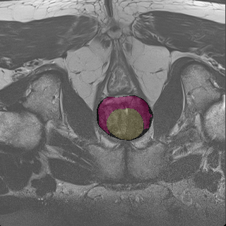

# u-net protate seg
对前列腺3D图像进行三分类分割
## 数据预处理
对于nii文件可以直接使用simpleitk包对图像进行读取显示，第一选择制作npy文件进行处理；第二直接读取显示保存为uint8图像，后续进行处理，前后两种方法需要图像标签以以对应；本文选择第二种方法，nii3D_dataset_generate.py脚本文件，批量处理nii文件。

## u-net文件
unet模型左部分由VGG构成，train_model训练模型，config.py设置模型训练参数；datas文件存放数据；

## 训练结果

使用predict.py

# 测试图像

预测的背景图-0

预测的分割-1

预测的分割-2

使用predict_color.py

叠加显示
